# Lists

## Overview


### List are continuous, vertical indexes of text or images


## Anatomy

### 1. Definition

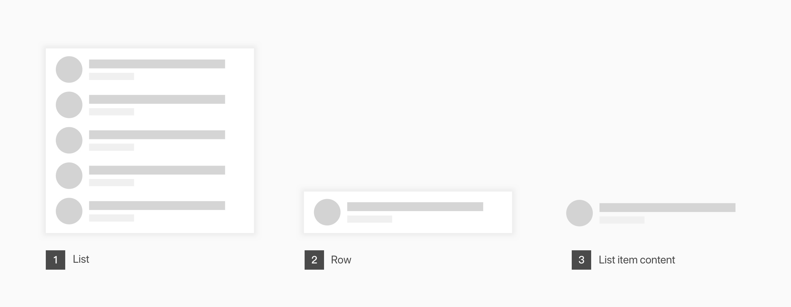

1. **List**  리스트는 vertical index를 일컫는다.
2. **Row**  리스트의 기본단위는 행이며, 행들이 모여 리스트가 된다.
3. **List item content**  하기 설명 참


### 2. Content Types

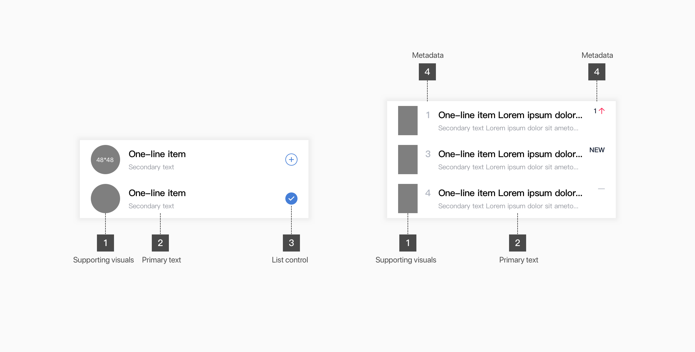

1. **Supporting visuals**  [**Avatar**↗](../foundation/communication/imagery.md#avatar)  [**Thumbnail**](../foundation/communication/imagery.md#thumbnail-image)↗ 
2. **Primary text**   Title with secondary text 전체를 Primary text라 일컫는다. Title을 기준으로 One-line, Two-line, Three-line을 정의한다. \(Secondary text는 고려하지 않는\)
3. **List control**  Select, edit \(delete and reorder\), collapsable
4. **Metadata**  Text number, tag, etc..


## Types

**리스트는 다음과 같은 기준으로 타입을 정의할 수 있다.**

| Type | Title | Secondary text | Control\* | State/meta |
| :--- | :--- | :--- | :--- | :--- |
| **1.Avatar with text** | One-line | Basic with icon |  |  |
|  |  | None | Select, Edit |  |
|  |  |  | Select, Edit |  |
|  |  |  | Select | Metadata |
|  |  |  |  |  |
| **2.Avatar with text & thumbnail** | One-line |  |  | Unread |
|  | Three-line |  |  | Unread |
|  |  |  |  |  |
| **3.Thumbnail with text** | Two-line | Longer |  |  |
|  | Three-line | Longer |  |  |
|  |  | Basic with icon |  |  |
|  |  |  |  |  |
| **4.Thumbnail with text & metadata** | \*\*\*\* | Two-basic |  | Metadata |
|  |  | Basic with icon |  | Metadata |
|  |  | Longer |  | Two-metadata |
|  |  | Longer multi | Actions | Two-metadata |
|  |  |  |  |  |
| **5.Text only** | One-line |  |  | Selected |
|  |  |  | Collapsible |  |
|  | One-line with  icon |  | Collapsible |  |


List control 은 다음과 같이 세가지 타입으로 분류하여 리스트 타입 마지막 파트에 추가한다. 

* **Select**   Row 아이템 선택하거 선택되었음을 보여준다.
* **Edit**   Row 아이템을 삭제하거나 순서를 바꾼다.
* **Collapsible**  복수의 row 아이템들 펼치거나 접는다.


\*\*\*\*

### 

### 1. Avatar with text

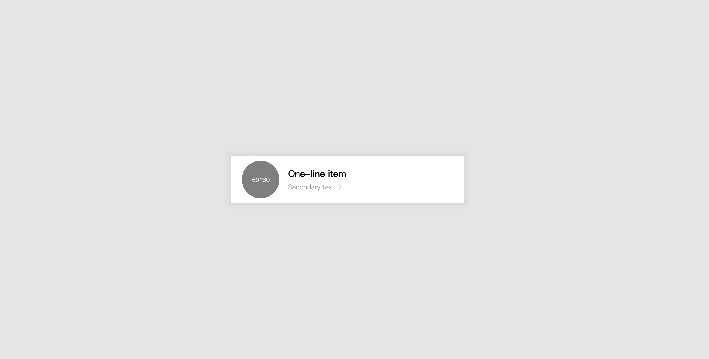



As an entry of the list of newsstands' article, it cues users to visit and check another list.


Related article [**Title section**](title.md#title-section)\*\*\*\*↗ 




```text
This is dummy

.Item-area {
  width: 339px;
  height: 60px;
  background-color: rgba(255, 255, 255, 0);
} 
.Figure-circle----Primary {
  width: 60px;
  height: 60px;
  opacity: 0.08;
}
.List-Content {
  width: 265px;
  height: 22px;
  font-family: PingFangTC;
  font-size: 15px;
  font-weight: 500;
  font-style: normal;
  font-stretch: normal;
  line-height: 1.47;
  letter-spacing: -0.4px;
  color: var(--black);
```





| Features | Page name |
| :--- | :--- |
| CP-Module | [See More Page Sample](https://zpl.io/VQKg4zx)🔗  |
| CP-Module | [Fold Page Sample](https://zpl.io/VQKJNym)🔗  |




### 2. Avatar with text with thumbnail

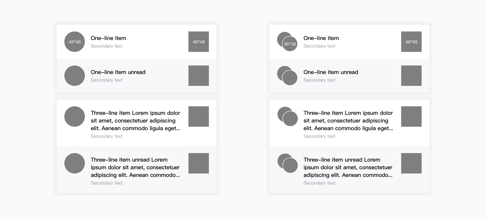







```text
This is dummy

.Item-area {
  width: 339px;
  height: 60px;
  background-color: rgba(255, 255, 255, 0);
} 
.Figure-circle----Primary {
  width: 60px;
  height: 60px;
  opacity: 0.08;
}
```





| Features | Page name |
| :--- | :--- |
| UGC | Buzz Notification Page Sample |




### 3. Thumbnail with text

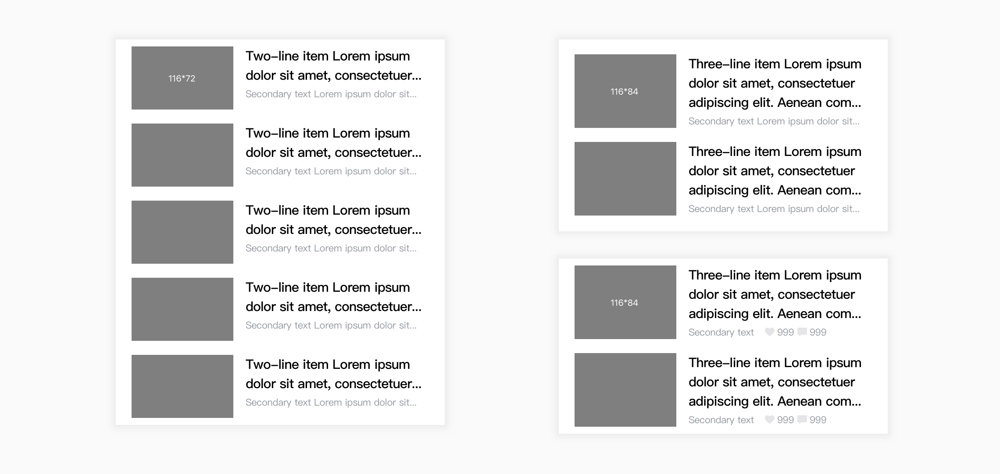







```text
This is dummy

.Item-area {
  width: 339px;
  height: 60px;
  background-color: rgba(255, 255, 255, 0);
} 
.Figure-circle----Primary {
  width: 60px;
  height: 60px;
  opacity: 0.08;
}
```



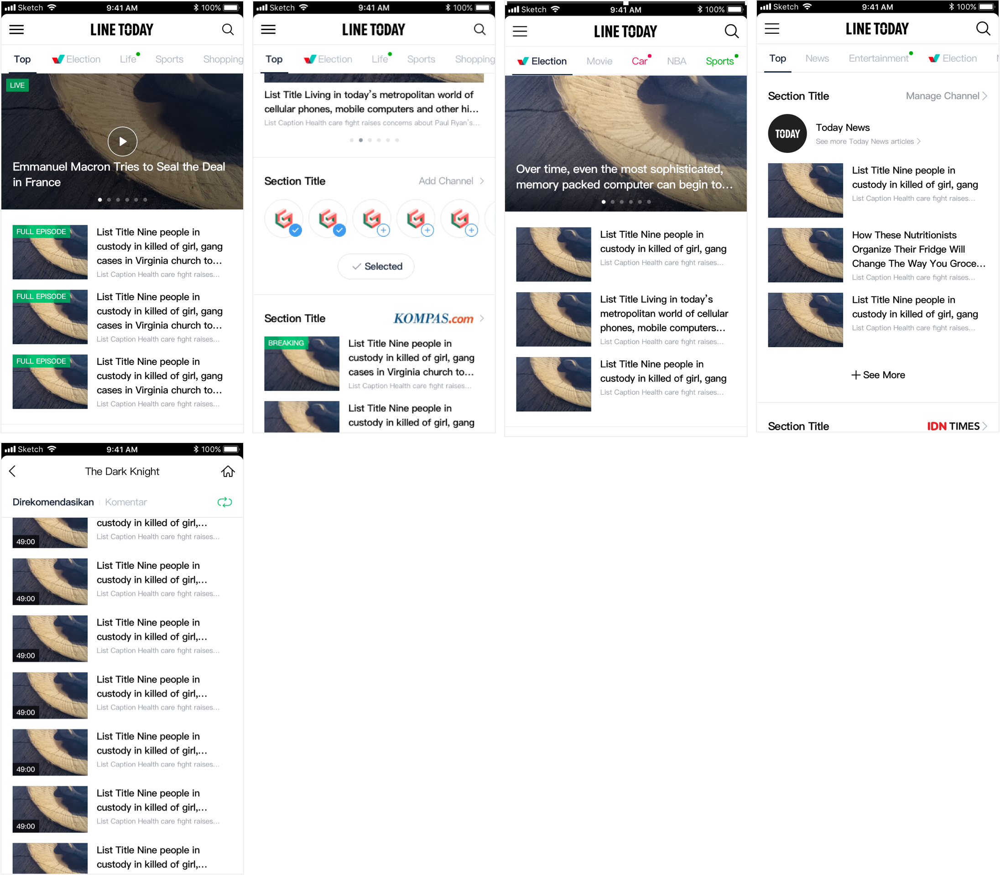

| Features | Page name |
| :--- | :--- |
| Today | Channel Page Sample |
|  | End Sample - Channel 1-2 |
| Movie |  |
| UGC |  |
| CP-Module | See More Page Sample |
| Election |  |




### 4. Thumbnail with text & metadata

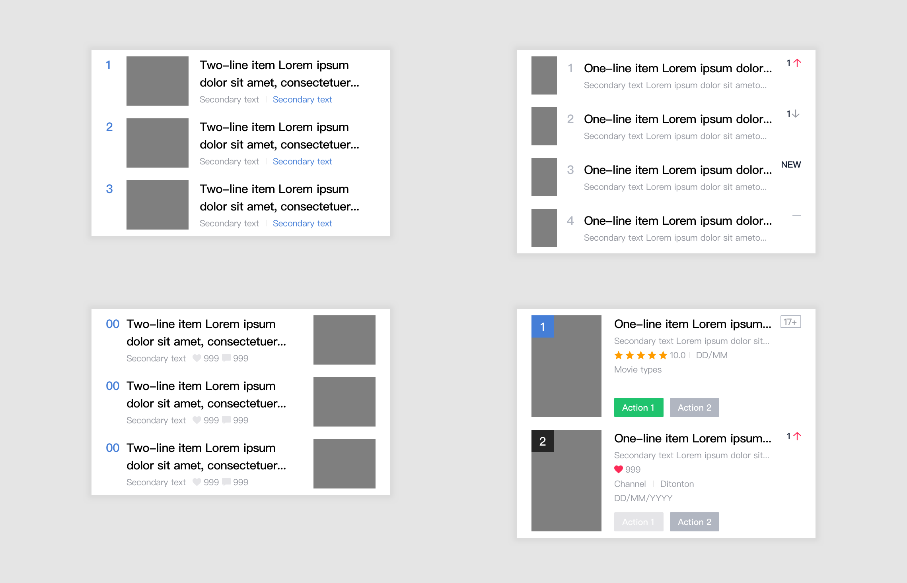







```text
This is dummy

.Item-area {
  width: 339px;
  height: 60px;
  background-color: rgba(255, 255, 255, 0);
} 
.Figure-circle----Primary {
  width: 60px;
  height: 60px;
  opacity: 0.08;
}
```








### 5. Text only

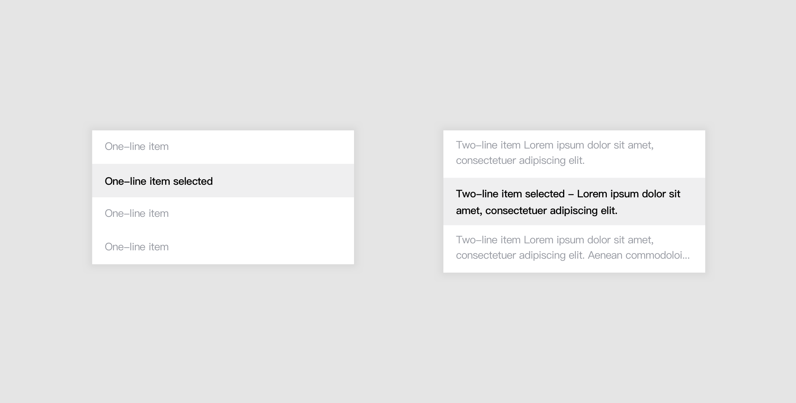







```text
This is dummy

/* Hint text */
font-family: Helvetica;
font-weight: regular;
font-size: 11px;
color: $gray50;
margin-top : 5px;
```








Related article : [**Dialog**](../foundation/communication/dialog.md)↗  [**Menu**](menu.md)\*\*\*\*↗



### 6. List control : Select

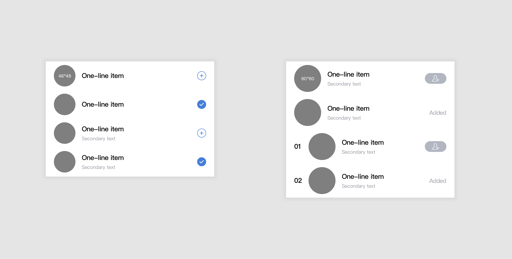


### 7. List control: Edit


### 8. List control: Collapsible


## Specs

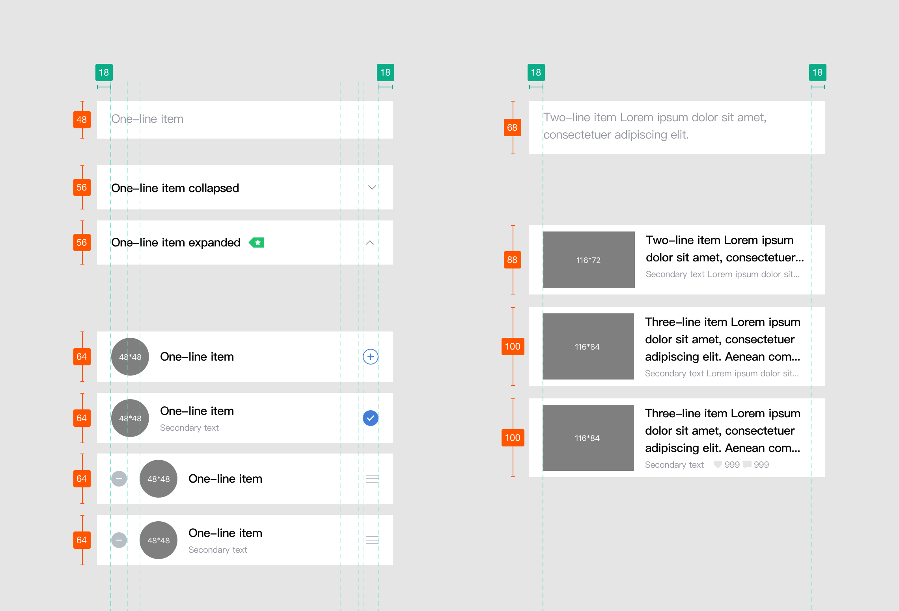

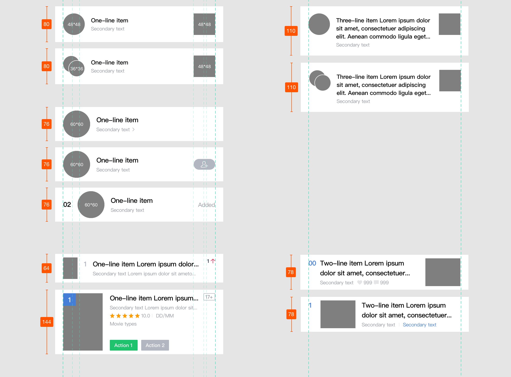


