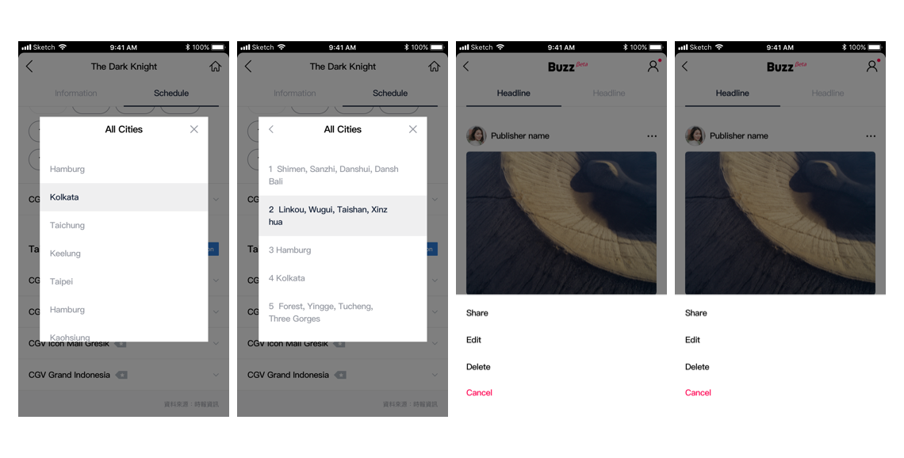

# Lists


## Anatomy

### 1. Definition


1. List : 리스트는 vertical index를 일컫는다.
2. Row : 리스트의 기본단위는 행이며, 행들이 모여 리스트가 된다.
3. List item content : 하기에서 설


### 2. Content Types


1. Supporting visuals : Avatar, Thumbnail
2. Primary text : Title with secondary text
3. List control: Select, edit \(delete and reorder\), collapsable
4. Metadata: Text, informative visuals


## Types

리스트는 다음과 같은 기준으로 타입을 정의할 수 있다.

| Type | Line | Control | State |
| :--- | :--- | :--- | :--- |
| Text only | One-line | Select | Normal |
| Avatar with text | Two-line | Edit | Selected |
| Avatar with text & thumbnail | Three-line | collapsable | Unread |
| Thumbnail with text |  | CTA |  |
| Thumbnail with text & metadata |  |  |  |

### 

### 1. Text only




```text
/* Hint text */
font-family: Helvetica;
font-weight: regular;
font-size: 11px;
color: $gray50;
margin-top : 5px;

/* Error hint text */
font-weight: bold;
color: $red50;

/* Link/action text */
font-weight: bold;
color: $blue50;

/* Disabled */
color: $gray40;
```








Related article : Dialog, Menu







### 2. Avatar with text

