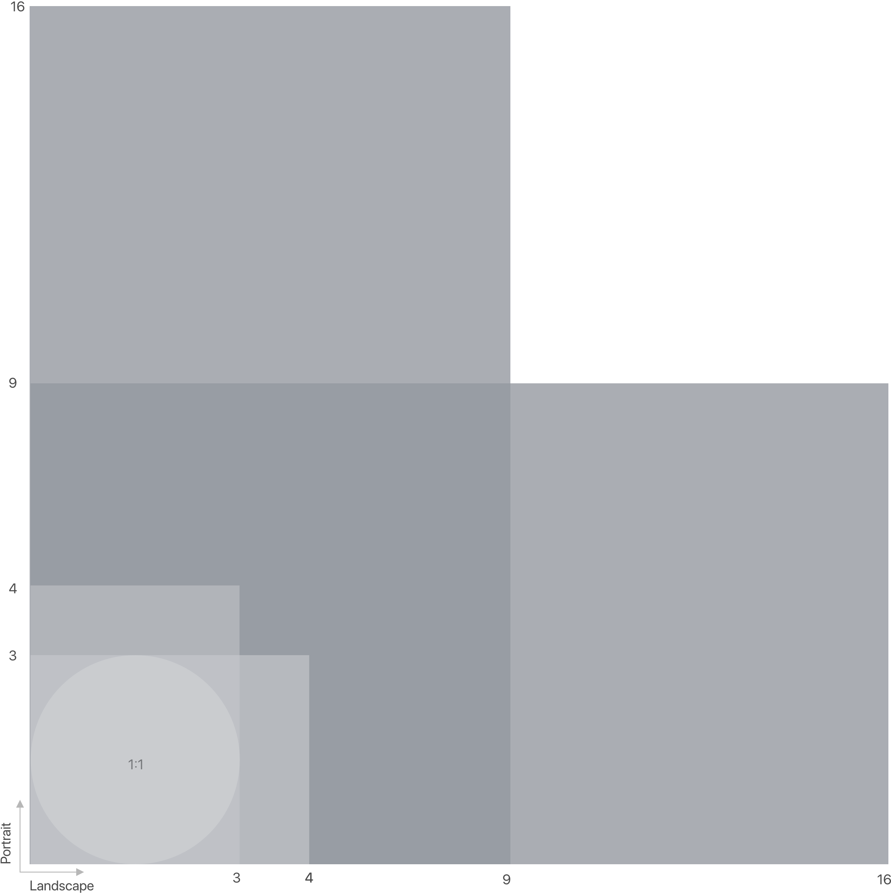
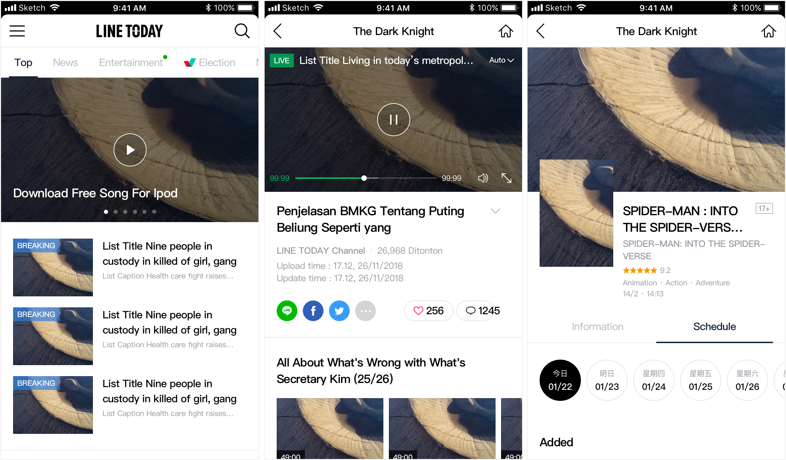
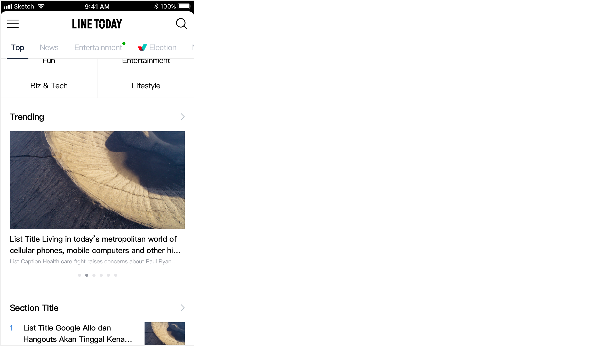
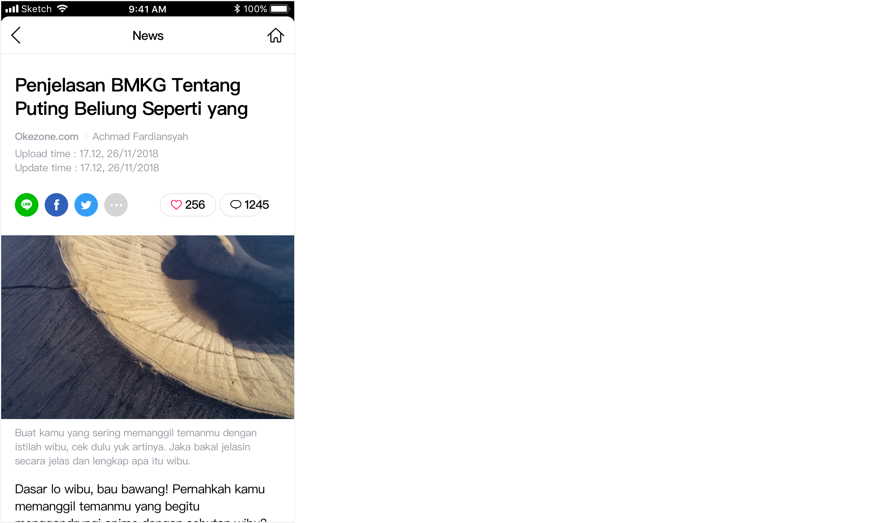

# Imagery

## Overview

### Imagery communicates and differentiates a product through visuals.

## Aspect ratio

The aspect ratio of an image is the proportional relationship of the width to the height. The relationship between its width and height determines the ratio and shape, but not the image’s actual size.

## Hero image

Hero images help draw attention, provide context about content, or reinforce a brand. Hero images are anchored in the most prominent position, such as the top of the screen. 

**Aspect ratio  16:9**












| Features | Page | size |
| :--- | :--- | :--- |
| Today | Channel Page Sample | 375\*210 |
|  | End Sample - Channel 3-1 |  |
| Movie | End Sample - Movie Schedule Page 1 |  |
| Today | Home Page Sample | 339\*190 |
|  | End Sample - Article | 375\*235 |



## Thumbnail

Thumbnails are small images that represent information in tight spaces. They typically act as tap targets that lead to primary content, appearing within components like cards or lists. Thumbnails can be cropped in different shapes.











## **Informational image**

Informational imagery assists users in understanding content, without being the focal point in a UI. It can take the form of icons, diagrams, and avatars that represent entities or content, either literally or conceptually. They occupy minimal space

### Avatar

Avatars should focus on a subject, using a simple background. They can represent a user or a brand \(with a logo or branded graphic\).











### Diagram

### Icon

